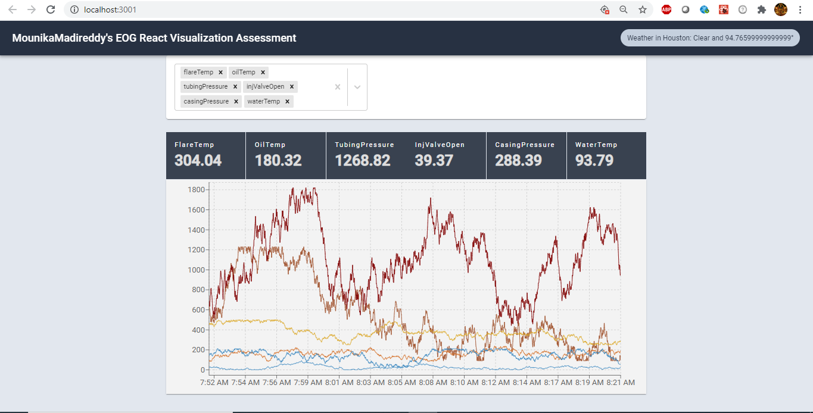

## Create React App Visualization

This assessment was bespoke handcrafted for MounikaMadireddy.

Read more about this assessment [here](https://react.eogresources.com)

## Installation
git clone https://github.com/mounicareddy/mounikamadireddy-eog-react-assessment.git

cd mounikamadireddy-eog-react-assessment.git

yarn install

## Modules Used

* material-ui
* graphql
* react-multi-select-component
* recharts

## Overview

## Ways to optimize
* Using Subscriptions instead of polling

## References
* http://recharts.org/en-US/
* https://material-ui.com/
* https://reactjs.org/docs/hooks-intro.html

